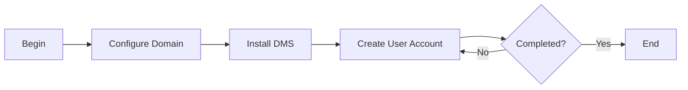

# Docker Email Server

### Author: Mohamed Jawahar Hussain

## Introduction

Installation of Docker Email server.

## Prerequisite

|Action|Reference|
|--|--|
| Docker Installation |[here](/maximo/docs/administration/sets/01-item-set.md)|

## Process Diagram



## Execution Steps

Edit /etc/hosts file in the system where the docker email server is intended to be installed.
Make the following entry:
```
127.0.0.1       maximo maximo.com
```

**Podman**

```CMD
podman run -d --name maximo-dms -p 3025:25  -p 3143:143 -p 3993:993 -e OVERRIDE_HOSTNAME=maximo -e DOMAINNAME=maximo.com -v dms-data:/var/mail  -v dms-state:/var/mail-state dms-config:/tmp/docker-mailserver/  mailserver/docker-mailserver:latest
```
```CMD
podman exec -it maximo-dms setup email add md.jawahar@maximo.com password
```
```CMD
podman exec -it maximo-dms setup email add azmi@maximo.com password
```

**Docker**

```CMD
docker run -d --name maximo-dms -p 3025:25 -p 3143:143 -p 3993:993 --hostname maximo --domainname maximo.com -v dms-config:/tmp/docker-mailserver/ -v dms-data:/var/mail/ -v dms-state:/var/mail-state/ mailserver/docker-mailserver:latest
```

```CMD
docker exec -it maximo-dms setup email add md.jawahar@maximo.com password
```
```CMD
docker exec -it maximo-dms setup email add azmi@maximo.com password
```

## Success Metric

The Docker Email Server container should be up and running.

```CMD
docker ps
```

```
jawahar@MacBookPro codersyacht % docker ps
CONTAINER ID   IMAGE                                 COMMAND                  CREATED             STATUS             PORTS                                                                                                                                       NAMES
df478f467058   mailserver/docker-mailserver:latest   "/usr/bin/dumb-init …"   About an hour ago   Up About an hour   110/tcp, 465/tcp, 587/tcp, 993/tcp, 995/tcp, 4190/tcp, 0.0.0.0:3025->25/tcp, [::]:3025->25/tcp, 0.0.0.0:3143->143/tcp, [::]:3143->143/tcp   maximo-dms
```

Should be able to connect to both SMTP and IMAP port.

```CMD
telnet localhost 3143
```
```CMD
telnet localhost 3025
```

## Next Steps

|Action|Reference|
|--|--|
| Thunderbird Mail Client Installation |[here](/devops/email-server/thunderbird.md)|

