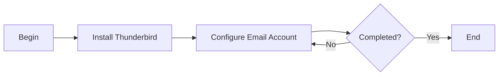

# Thunderbird

### Author: Mohamed Jawahar Hussain

## Introduction

Installation of Thunderbird Email client.

## Prerequisite

|Action|Reference|
|--|--|
| Email Server Configuration |[here](/devops/email-server/docker-mail-server.md)|

## Process Diagram

## Installation 

- Download Firefix Thunderbird [here](https://download.mozilla.org/?product=thunderbird-151.0-SSL&os=osx&lang=en-US)
- Install Thunderbird by clicking Thunderbird.dmg. 
- Move Thunderbird to Applications.
- Launch Thunderbird.

## Setup Email Account

Click _Setup Anorther Account - Email_.

|Attribute | Value |
|---|---|
| Full Name | Jawahar Hussain |
| Email Address | md.jawahar@cdy.com |
| Protocol | IMAP |
| Hostname | mail.cdy.com |
| Port | 3143 |
| Connection Security | None |
| Authentication Method | Normal Password |
| Username | md.jawahar@cdy.com |

Continue.

|Attribute | Value |
|---|---|
| Protocol | SMTP |
| Hostname | mail.cdy.com |
| Port | 3025 |
| Connection Security | None |
| Authentication Method | Normal Password |
| Username | md.jawahar@cdy.com |

- Click Test.
- The result should be The following settings were found by probing the given server:.
- Click Continue.
Provide password at password prompt. If email server was created using [this](maximo-knowledge-center/blob/main/devops/email/docker-mail-server.md) instruction, the the password is _password_.

Add another account.

|Attribute | Value |
|---|---|
| Full Name | Amirul Azmi |
| Email Address | azmi@cdy.com |
| Protocol | IMAP |
| Hostname | mail.cdy.com |
| Port | 3143 |
| Connection Security | None |
| Authentication Method | Normal Password |
| Username | azmi@maximo.com |

Continue.

|Attribute | Value |
|---|---|
| Protocol | SMTP |
| Hostname | mail.cdy.com |
| Port | 3025 |
| Connection Security | None |
| Authentication Method | Normal Password |
| Username | azmi@cdy.com |

- Click Test.
- The result should be The following settings were found by probing the given server:.
- Click Continue. Provide password at password prompt. If email server was created using this instruction, the the password is password.

## Success Criteria

Able to Send, Receive and Reply to emails within the same doman and existing accounts.

## Next Steps

NA
