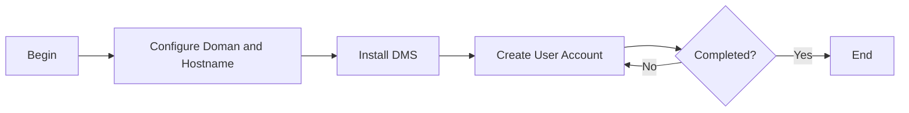

# Docker Email Server

### Author: Mohamed Jawahar Hussain

## Introduction

## Prerequisite

|Action|Reference|
|--|--|
| Docker Installation |[here](/maximo/docs/administration/sets/01-item-set.md)|

## Process Diagram



## Execution Steps

```CMD
docker run -d --name maximo-dms -p 3025:25 -p 3143:143 --hostname maximo --domainname maximo.com -v dms-config:/tmp/docker-mailserver/ -v dms-data:/var/mail/ -v dms-state:/var/mail-state/ mailserver/docker-mailserver:latest
```

```CMD
docker exec -it maximo-dms setup email add md.jawahar@maximo.com password
```

```CMD
docker exec -it maximo-dms setup email add azmi@maximo.com password
```
