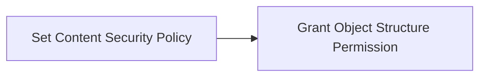

# Map Manager

### Author Mohamed Jawahar Hussain

## Introduction

Create a Map Manager

## Prerequisite

| Action       |  Reference    |
|--------------|---------------|
|Provide full access to the following object resources: <br> - MXMAPMAN <br> - MXAPIMAPMANAGER <br> - MXAPIMESSAGE <br> - MAXMESSAGES| [here](https://github.com/codersyacht/maximo-knowledge-center/blob/main/maximo/integration/object-structures/access.md)|

## Process Diagram



## Execution Steps

### Set Content Security Policy

- Navigate to System Configuration -> Platform Configuration -> System Properties
- Search for property name **mxe.sec.header.Content_Security_Policy**
- Edit the default value, add *.openstreetmap.org to the img-src parameter.
- Example:
```PROP
img-src 'self' d2qhvajt3imc89.cloudfront.net data: _*.openstreetmap.org_ *.walkme.com *.{{DOMAIN_NAME}} *.trustarc.com *.qualtrics.com
```
- Save

### Object Resouce Permission
