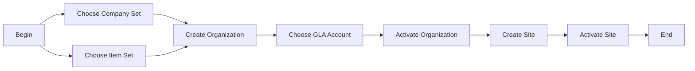

# Organizations

### Author: Mohamed Jawahar Hussain

### Prerequisite

| Requirement  | Reference |
|--------|-------|
|Maximo installed and manage application accessible.||
|Create Item Set.|[here](/maximo/administration/sets/01-item-set.md)|
|Create Company Set.| [here](/maximo/administration/sets/02-company-set.md)|
Create GLA Account.|[here](/maximo/finance/chart-of-accounts/01-gl-components.md)|
## Introduction

In Maximo, an Organization is a foundational data structure that defines how your company—or multiple companies—are represented within the system. It’s not just a label; it’s a container for business rules, financial settings, and operational data.



## Create Organization

| Field  | Value |
|--------|-------|
| URL    | /maximo/oslc/os/mxorganization |
| Method | POST  |

```JSON
{

    "spi:itemsetid": "CDYISET",
    "spi:companysetid": "CDYCSET",
    "spi:description": "CDY",
    "spi:dfltitemstatus_description": "Active",
    "spi:dfltitemstatus": "ACTIVE",
    "spi:orgid": "CDY",
    "spi:enterby": "MAXADMIN",
    "spi:category": "STK",
    "spi:active": false,
    "spi:basecurrency1": "USD"
}
```

## Success Criteria
API executed successfully.
Organization CDY created.

## Get Organization 

```URL
/maximo/oslc/os/mxorganization?oslc.where=orgid="CDY"
```
Method: Get

Result:
```JSON
{
    "prefixes": {
        "rdf": "http://www.w3.org/1999/02/22-rdf-syntax-ns#",
        "rdfs": "http://www.w3.org/2000/01/rdf-schema#",
        "oslc": "http://open-services.net/ns/core#"
    },
    "oslc:responseInfo": {
        "rdf:about": "http://localhost/maximo/oslc/os/mxorganization?oslc.where=orgid=%22CDY%22"
    },
    "rdfs:member": [
        {
            "rdf:resource": "http://localhost/maximo/oslc/os/mxorganization/_Q0RZ"
        }
    ],
    "rdf:about": "http://localhost/maximo/oslc/os/mxorganization"
}
```

## Get Specific Organization:

```URL
/maximo/oslc/os/mxorganization/_Q0RZ
```
Method: Get

Result:
```JSON
{
    "address_collectionref": "http://localhost/maximo/oslc/os/mxorganization/_Q0RZ/address",
    "spi:itemsetid": "CDYISET",
    "site_collectionref": "http://localhost/maximo/oslc/os/mxorganization/_Q0RZ/site",
    "spi:description": "CDY",
    "spi:dfltitemstatus_description": "Active",
    "spi:dfltitemstatus": "ACTIVE",
    "spi:orgid": "CDY",
    "rdf:about": "http://localhost/maximo/oslc/os/mxorganization/_Q0RZ",
    "spi:enterdate": "2026-03-06T04:33:10+00:00",
    "spi:enterby": "MAXADMIN",
    "prefixes": {
        "rdf": "http://www.w3.org/1999/02/22-rdf-syntax-ns#",
        "spi": "http://jazz.net/ns/ism/asset/smarter_physical_infrastructure#",
        "oslc": "http://open-services.net/ns/core#"
    },
    "_rowstamp": "2681555",
    "spi:category": "STK",
    "spi:companysetid": "CDYCSET",
    "spi:active": false,
    "spi:organizationid": 8,
    "spi:basecurrency1": "USD"
}
```
## Next Step


|Reqururement| Refecence |
|------------|-----------|
|Configure Clearance Account.|[here](maximo/administration/organizations/03-set-organization-clearance-account.md)|
|Activate Organization.|[here](maximo/administration/organizations/04-organization-activation.md)|
|Create Site. |[here](/maximo/administration/organizations/02-site-definition.md)|
|Activate Site.|[here](main/maximo/administration/organizations/05-organization-site-activation.md)|
