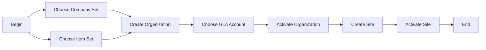

# Organizations

### Author: Mohamed Jawahar Hussain

## Introduction

In IBM Maximo, an Organization is the top-level entity that defines the business or operational unit responsible for managing assets, locations, financial records, and related data. It provides the hierarchical structure for your company and controls how data is shared across divisions, departments, and external partners.

## Prerequisite

| Action  | Reference |
|--------|-------|
|Create Item Set.|[here](/maximo/administration/sets/01-item-set.md)|
|Create Company Set.| [here](/maximo/administration/sets/02-company-set.md)|
Create GLA Account.|[here](/maximo/finance/chart-of-accounts/02-gl-account.md)|

## Process Diagram

## Execution Steps

### Create Organization

**API**

| Attribute  | Value |
|--------|-------|
| URL    | /maximo/oslc/os/mxorganization |
| Method | GET  |
| Payload | [here](maximo/administration/organizations/api/organization-definition.json) |

## Success Metric
API executed successfully.
Organization CDY created.

### Get Organization 

**API**

| Attribute  | Value |
|--------|-------|
| URL    | /maximo/oslc/os/mxorganization?oslc.where=orgid="CDY" |
| Method | GET  |
| Response | [here](/maximo/administration/organizations/api/get-organization-response.json) |

### Get Specific Organization

**API**

| Attribute  | Value |
|--------|-------|
| URL    | /maximo/oslc/os/mxorganization/_Q0RZ |
| Method | GET  |
| Response | [here](/maximo/administration/organizations/api/get-specific-organization-resppnse.json) |

## Next Step

|Action | Refecence |
|------------|-----------|
|Configure Clearance Account.|[here](/maximo/administration/organizations/03-set-organization-clearance-account.md)|
|Activate Organization.|[here](/maximo/administration/organizations/04-organization-activation.md)|
|Create Site. |[here](//maximo/administration/organizations/02-site-definition.md)|
|Activate Site.|[here](/main/maximo/administration/organizations/05-organization-site-activation.md)|
