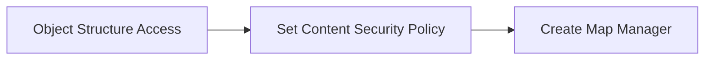

# Spatial

### Author Mohamed Jawahar Hussain

## Introduction

Create a Map Manager

## Prerequisite

| Action       |  Reference    |
|--------------|---------------|
|Provide full access to the following object resources: <br> - MXMAPMAN <br> - MXAPIMAPMANAGER <br> - MXAPIMESSAGE <br> - MAXMESSAGES| [here](https://github.com/codersyacht/maximo-knowledge-center/blob/main/maximo/integration/object-structures/access.md)|

## Process Diagram



## Execution Steps

```CMD
openssl s_client -connect basemaps.arcgis.com:443 -showcerts
```

```CMD
keytool -importcert -alias arcgis.com -file arcgis.com.pem -keystore key.p12  -storetype PKCS12
```
