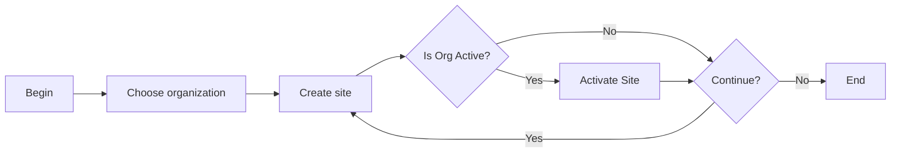

# Site

### Author: Mohamed Jawahar Hussain

### Prerequisite

Organization defined.

## Introduction

A site is a division within an organization that maintains certain data independently from other sites.”

## Create Site

[**API**](/maximo/api/administration/organization/create-site.json)

## Success Criteria
API executed successfully.
Site BL created.

### Find Site

[**API**](/maximo/api/administration/organization/find-site.json)

### Get Site:

[**API**](/maximo/api/administration/organization/get-site.json)

## Next Step

|Action|Reference|
|------|---------|
|Activate Site| /maximo/docs/administration/organization/05-organization-site-activation.md |
