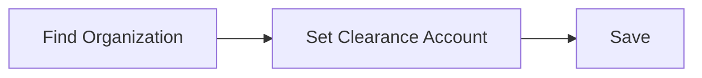

# Set Clearance Account

### Author: Mohamed Jawahar Hussain

## Introduction

Set clearance account for the orgaqnization

### Prerequisite

|Action|Reference|
|------|---------|
| Configure GL Account. | [here](/maximo/docs/finance/chart-of-accounts/02-gl-account.md) |

## Process Diagram

## Execution Steps

### Set Clearance Account

[**API**](/maximo/api/administration/organization/set-clearance-account.json)

## Success Metric

Check if get organization has clearance account set. [**API**](/maximo/api/administration/organization/get-organization.json)

## Next Step

|Action|Reference|
|------|---------|
| Activate Organization. | [here](/maximo/docs/administration/organization/04-organization-activation.md) |

