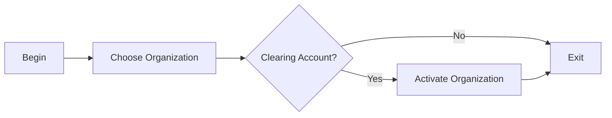

# Organization Activation

### Author: Mohamed Jawahar Hussain

## Intoduction

Activate the organization.

## Prerequisite

|Action|Reference|
|--|--|
|Orgazation Configured|[here](/maximo/docs/administration/organization/01-organization-definition.md)|

## Process Diagram

## Execution Steps

[**API**](/maximo/api/administration/organization/set-organization-active.jjson)

## Success Criteria

Check if get organization shows organization as active. [**API**](/maximo/api/administration/organization/get-organization.json)

## Next Step

Not Applicable
