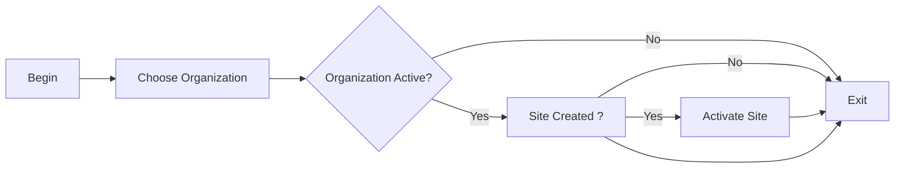

# Organization Site Activation

### Author: Mohamed Jawahar Hussain

## Intoduction

Activate the organization site.

## Prerequisite

|Action|Reference|
|--|--|
|Orgazation Configured|[here](/maximo/docs/administration/organization/01-organization-definition.md)|
|Site Configured|[here](/maximo/docs/administration/organization/02-site-definition.md)|

## Process Diagram

## Execution Steps

### Activate Site

[**API**](/maximo/docs/administration/organization/05-organization-site-activation.md)

## Success Criteria

Check if get site shows site as active. [**API**](/maximo/api/administration/organization/get-site.json)

## Next Step

Not Applicable.
