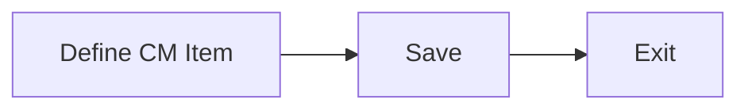

# Models

### Author: Mohamed Jawahar Hussain

## Introduction

## Prerequisite

| Action  | Reference |
|--------|-------|
| ||

## Process Diagram

## Execution Steps

### Define Model

- Navigate to Asset Configuration Manager (CM) -> CM Item Master (CM)
- New CM Item.
- Provide a Part name.
- Save

[API](/maximo/api/asset-configuration-manager/cm-item-master-(cm)/define-cm-item-master.json)
  

## Next Step

