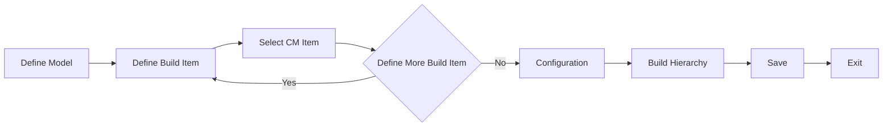

# Models

### Author: Mohamed Jawahar Hussain

## Introduction

## Prerequisite

## Prerequisite

| Action  | Reference |
|--------|-------|
|Create CM Item.|[here](/maximo/docs/administration/sets/01-item-set.md)|

## Process Diagram

## Execution Steps

### Define Model

- Navigate to Asset Configuration Manager (CM) -> Models (CM)
- New Model
- Provide a Model name.
- Save

[API](/maximo/api/asset-configuration-manager/models(cm)%20/create-model.json)
  

## Next Step

