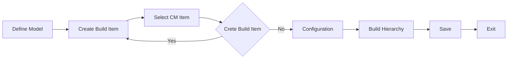

# Models

### Author: Mohamed Jawahar Hussain

## Introduction

## Prerequisite

## Process Diagram

## Execution Steps

### Create Model

- Navigate to Asset Configuration Manager (CM) -> Models (CM)
- New Model
- Provide a Model name.
- Save

[API](/maximo/api/asset-configuration-manager/models(cm)%20/create-model.json)
  

## Next Step

