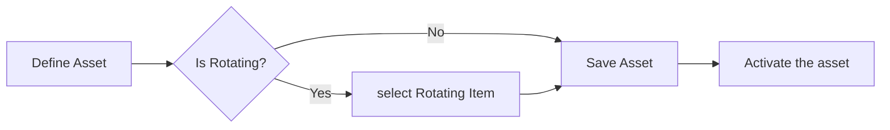

# Create Assets

### Author: Mohamed Jawahar Hussain

## Introduction

Create a standalone asset.

## Prerequisite

|Action | Reference|
|-------|----------|
|Define Item|[here](/maximo/docs/inventory/item-definition.md)|
|Organization Site Activation|[here](/maximo/docs/administration/organization/05-organization-site-activation.md)|

## Process Diagram

## Execution Steps

- In the Maximo Manage application, Navigate to Assets -> Assets.
- Select New Asset.
- Provide Asset name.
- Choose a rotating item if this is a rotating asset.
- Save.
- Change Status to active.

[API]()

## Success Criteria

Asset is successfully created.

## Next Step

Not Applicable
