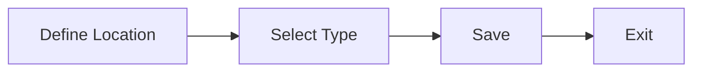

# Create Locations

### Author: Mohamed Jawahar Hussain

## Introduction

Create a locations.

## Prerequisite

|Action | Reference|
|-------|----------|
|Organization Site Activation|[here](/maximo/docs/administration/organization/05-organization-site-activation.md)|

## Process Diagram

## Execution Steps

- In the Maximo Manage application, Navigate to Assets -> Locations.
- Select New Location.
- Provide Location name.
- Choose a Type as Operating.
- Save.

[API](/maximo/api/assets/create-location.json)

## Success Criteria

Asset is successfully created.

## Next Step

Not Applicable
