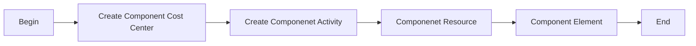

# Chart of Accounts

## Introduction

Maximo GL components are segments that structure the General Ledger (GL) account code, allowing for detailed cost tracking and integration with financial systems.

## Prerequisite

No prerequisite required.

## Process Diagram

## Execution Steps

### Create GL Components

| Action    | Reference  |
|----------|------------|
| Create GL Component Cost Center | [**API**](/maximo/api/finance/chart-of-accounts/create-gl-component-cost-center.json) |
| Create GL Component Activity | [**API**](/maximo/api/finance/chart-of-accounts/create-gl-component-activity.json) |
| Create GL Component Resource | [**API**](/maximo/api/finance/chart-of-accounts/create-gl-component-resource.json) |
| Create GL Component Element | [**API**](/maximo/api/finance/chart-of-accounts/create-gl-component-element.json) |

## Success Metric

## Next Step

| Action | Reference |
|----|----|
|Create GL Account|[here](/maximo/docs/finance/chart-of-accounts/02-gl-account.md)|
