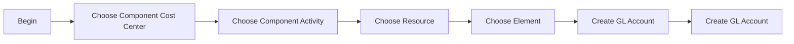

# GL Account

### Author: Mohamed Jawahar Hussain

## Introduction

GL Account (General Ledger Account) is the full accounting string that identifies where financial transactions should be posted in your organization’s financial system. It’s essentially the combination of GL Components (segments like company, department, cost center, and account type) arranged in a defined sequence.

## Prerequisite

| Action | Reference |
|----|----|
|Create GL Components|[here](/maximo/docs/finance/chart-of-accounts/01-gl-components.md)|

## Process Diagram

## Execution Steps

### Create GL Account

[**API**](/maximo/api/finance/chart-of-accounts/create-gl-account.json)

## Next Step

| Action | Reference |
|----|----|
|Create Organization|[here](/maximo/docs/administration/organization/01-organization-definition.md)|
