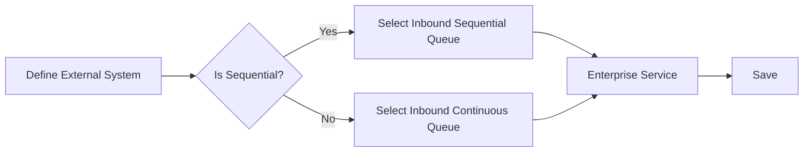

# External System

### Author: Mohamed Jawahar Hussain

## Introduction

External System consists of configuration to interact with external system. It can be used to both publish and/or consume messages from external system.

## Prerequisite

**Publishing Message to external System**

|Action|Reference|
|-------|--------|
|Publish Channel|[here](/maximo/docs/integration/publish-channels.md)|

**Consuming Message to external System**

|Action|Reference|
|-------|--------|
|Enterprise Service|[here](/maximo/docs/integration/enterprise-services.md)|

## Process Diagram

**Publishing Message to external System**


**Consuming Message for Internal Processing**



## Execution Steps

**Publishing Message to external System**

- Navigate to Integration -> External Systems.
- Select new External Systems.

Provide the following values in the System tab.

|Attribute|Value|
|-------|--------|
|System|external system|
|Description|external system|
|Outbound Sequential Queue|jms/maximo/int/queues/sqout|
|Endpoint|publish|

- Under Publish Channel tab, select the publish channel. Select the publish endpoint.
- Select Enable.
- Under System tab, select Enable.
- Save.

**Consuming Message for Internal Processing**

- Navigate to Integration -> External Systems.
- Select new External Systems.

Provide the following values in the System tab.

|Attribute|Value|
|-------|--------|
|System|external system|
|Description|external system|
|In Sequential Queue|jms/maximo/int/queues/sqin|

- Under Enterprise Services tab, select the enterprise services consumer.
- Select Enable.
- Under System tab, select Enable.
- Save.


## Success Criteria

**Publishing Message to external System**

- External System configuration is successful. 
- If the JMS Consumer cron task is configured, the following behaviour will be seen.
  - When a new item is created, the JSON message of the object will be sent to the sqout JMS queue.
  - The message should be visible under Integration -> Message Tracking.

**Consuming Message for Internal Processing**

The following JMS messages posted to the jms/maximo/int/queues/sqin queue will be consumed by the JMS Consumer cron task and Item object will be created.

```XML
<SyncMXITEM xmlns="http://www.ibm.com/maximo">
  <MXITEMSet>
    <ITEM>
      <ITEMNUM>FILTER-HVAC-002</ITEMNUM>
      <DESCRIPTION>HEPA Filter for HVAC Unit Model 5001</DESCRIPTION>
      <ITEMSETID>SET1</ITEMSETID> 
    </ITEM>
  </MXITEMSet>
</SyncMXITEM>
```

Following Jave JMS property need to be set.
```Java
msg.setStringProperty("INTERFACE", enterpriseService);     // Enterprise Service name
msg.setStringProperty("msgoperation", "Sync");  // Sync | Create | Update | Delete
msg.setStringProperty("SENDER", externalSystem); // External System name
```

## Next Action

|Action |Reference|
|-------|--------|
|Configure JMS Consumer|[here]()|

