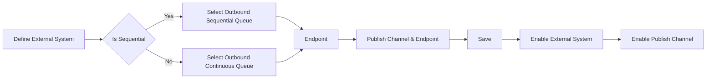

# External System

### Author: Mohamed Jawahar Hussain

## Introduction

External System consists of configuration to interact with external system. It can be used to both publish and/or consume messages from external system.

## Prerequisite

**Publishing Message to external System**

|Action|Reference|
|-------|--------|
|Publish Channel|[here](/maximo/docs/integration/publish-channels.md)|

**Consuming Message to external System**

|Action|Reference|
|-------|--------|
|Enterprise Service|[here](/maximo/docs/integration/enterprise-services.md)|

## Process Diagram

**Publishing Message to external System**

