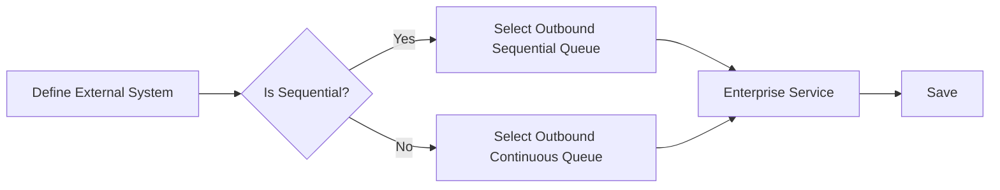
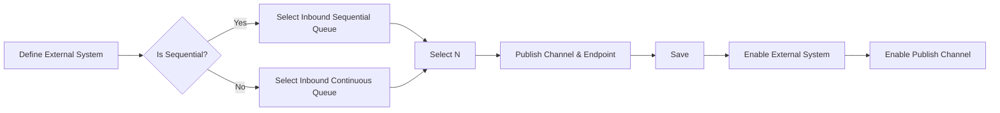

# External System

### Author: Mohamed Jawahar Hussain

## Introduction

External System consists of configuration to interact with external system. It can be used to both publish and/or consume messages from external system.

## Prerequisite

**Publishing Message to external System**

|Action|Reference|
|-------|--------|
|Publish Channel|[here](/maximo/docs/integration/publish-channels.md)|

**Consuming Message to external System**

|Action|Reference|
|-------|--------|
|Enterprise Service|[here](/maximo/docs/integration/enterprise-services.md)|

## Process Diagram

**Publishing Message to external System**

**Consuming Message for Internal Processing**

## Execution Steps

- Navigate to Integration -> External Systems.
- Select new External Systems.

Provide the following values in the System tab.

|Attribute|Value|
|-------|--------|
|System|external system|
|Description|external system|
|Outbound Sequential Queue|jms/maximo/int/queues/sqout|
|Endpoint|publish|

- Under Publish Channel tab, select the publish channel. Select the publish endpoint.
- Select Enable.
- Under System tab, select Enable.
- Save.

## Success Criteria

- External System configuration is successful. 
- If the JMS Consumer cron task is configured, the following behaviour will be seen.
  - When a new item is created, the JSON message of the object will be sent to the sqout JMS queue.
  - The message should be visible under Integration -> Message Tracking.

## Next Action

|Action |Reference|
|-------|--------|
|Configure JMS Consumer|[here]()|

