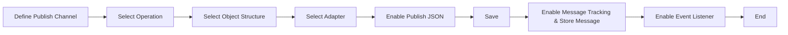

# Create Publish Channel

### Author: Mohamed Jawahar Hussain

## Introduction

Create a publish channel. It is the configuration responsible for posting message to an external system. The publish channel is a template that defines the object and it's format to be published. It does not contain any connection related information. The connection information is contained in Endpoint configuration.

## Prerequisite

|Action|Reference|
|------|---------|
|Configure Endpoint|[here](/maximo/docs/integration/endpoints.md)|

## Process Diagram

## Execution Steps

- Navigate to Integration -> Publish Channels.
- Select New Publish Channel.
- Set the following values. Do not change any default settings apart from those mentioned below.

|Attribute|Value|
|---------|----|
|Publish Channel |publisher|
|Description |publisher|
|Object Structure|MXITEM|
|Publish Channel|Enable|
|Adapter|Maximo|

- Save the configuration.
- Select Message Tacking and enable Message Tracking & Store Message.
- Enable Event Listener.

## Success Metric

Publish Channel created and enabled.

## Next Step

|Action|Reference|
|------|---------|
|Configure External System|[here](/maximo/docs/integration/external-systems.md)|
