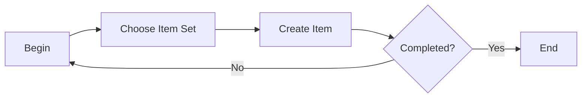

# Item Definition

### Author: Mohamed Jawahar Hussain

## Introduction

Define a new item

## Prerequisite

|Action|Reference|
|--|--|
|Define item set|[here](/maximo/docs/administration/sets/01-item-set.md)|

## Process Diagram

## Execution Steps

### Define Item

[**API**](/maximo/api/inventory/create-item.json)

## Success Metric
