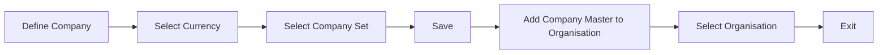

# Create Company

### Author: Mohamed Jawahar Hussain

## Introduction

A company is a vendor from whom the prganization purchases items.

## Prerequisite

## Prerequisite

| Action  | Reference |
|--------|-------|
|Create Company Set.|[here](/maximo/docs/administration/sets/02-company-set.md)|

## Process Diagram

## Execution Steps

### Define Model

- Navigate to Purchasing -> Company Master.
- New Company Master.
- Provide a Company Name and Description.
- Select Currency and Company Set.
- Save
- Click Add Company Master to Organisation in the side navigation.
- Select organisation and click ok.
- Exit.

[API](/maximo/api/purchasing/create-company.json)
  

## Next Step

NA

