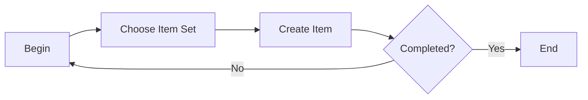

# E-mail Listeners

### Author: Mohamed Jawahar Hussain

## Introduction

## Prerequisite

## Process Diagram

## Execution Steps

|Attribute|Value|
|--|--|
|E-mail Address|md.jawahar@maximo.com|
|Description|md.jawahar@maximo.com|
|E-mail password|password|
|Mail Server|maximo.com|
|E-mail Folder|Inbox|
|Administrator E-mail|md.jawahar@maximo.com|
|Preprocessor|psdi.common.emailstner.Preprocessor|
|Object Key Delimiter|##|
|Workflow Process|LSNRBP|
|Schedule|30s|
|Cron Task Name|LSNRCRON|
|Cron Task Instance|LSNR9|
|Protocol|imap|
|Protocol|3143|
|Enable STARTTLS?|Yes|

## Next Steps

Not Applicable
