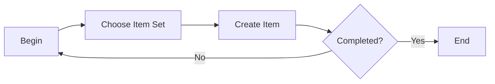

# E-mail Listeners

### Author: Mohamed Jawahar Hussain

## Introduction


## Prerequisite


Edit /etc/hosts file in the system where the docker email server is intended to be installed. Make the following entry:
```
9.60.155.138    codersyacht.com mail.codersyacht.com
```

| System Property | Value |
|------------------|-------|
|mxe.esigresetemailfrom|maxadmin@codersyacht.com|
|mail.smtp.host|mail.codersyacht.com|
|mail.smtp.port|3025|
|mail.smtp.ssl.enable|false|
|mail.smtp.starttls.enable|false|
|mxe.smtp.user|maxadmin@codersyacht.com|
|mxe.adminEmail|maxadmin@codersyacht.com|

Two users with e-mail ids mapped to the respective user account.
In this example the users are maxadmin (default user) and jawahar. The email id are:

|User|Email Id|
|----|--------|
|maxadmin|maxadmin@codersyacht.com|
|jawahar|md.jawahar@codersyacht.com|

## Process Diagram



## Execution Steps

### Configuring E-mail Listener

|Attribute|Value|
|--|--|
|E-mail Address|md.jawahar@codersyacht.com|
|Description|md.jawahar@codersyacht.com|
|E-mail password|password|
|Mail Server|mail.codersyacht.com|
|E-mail Folder|Inbox|
|Administrator E-mail|md.jawahar@codersyacht.com|
|Preprocessor|psdi.common.emailstner.Preprocessor|
|Object Key Delimiter|##|
|Workflow Process|LSNRBP|
|Schedule|30s|
|Cron Task Name|LSNRCRON|
|Cron Task Instance|LSNR9|
|Protocol|imap|
|Protocol|3143|
|Enable STARTTLS?|Yes|

### E-mail Format

```
#MAXIMO_EMAIL_BEGIN
LSNRACTION=CREATE
;
LSNRAPPLIESTO=SR
;
CLASS=SR
;
TICKETID=&AUTOKEY&
;
DESCRIPTION= My SR Attribute – value pairs creation TEST
;
SITEID=BEDFORD
;
LOCATION=CONF100
;
ASSETNUM=DISPL1
;
#MAXIMO_EMAIL_END
```

## Next Steps

Not Applicable
