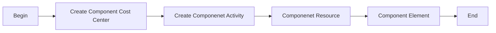

# Chart of Accounts

## Introduction

Maximo GL components are segments that structure the General Ledger (GL) account code, allowing for detailed cost tracking and integration with financial systems.

## Prerequisite

No prerequisite required.

## Process Diagram



## Execution Steps

### Create GL Components

| Steps    | Reference  |
|----------|------------|
| Create GL Component Cost Center | [here](/maximo/finance/chart-of-accounts/api/create-gl-component-cost-center.json) |
| Create GL Component Activity | [here](/maximo/finance/chart-of-accounts/api/create-gl-component-activity.json) |
| Create GL Component Resource | [here](/maximo/finance/chart-of-accounts/api/create-gl-component-resource.json) |
| Create GL Component Element | [here](/maximo/finance/chart-of-accounts/api/create-gl-component-element.json) |

```URL
http://codehub1.fyre.ibm.com:9080/maximo/oslc/os/mxglcomp
```

```JSON
{
  "spi:active": true,
  "spi:compvalue": "1000",
  "spi:userid": "MAXADMIN",
  "spi:orgid": "CDY",
  "spi:glorder": 0,
  "spi:comptext": "1000"
}
```

### Create GL Component Activity

```URL
http://codehub1.fyre.ibm.com:9080/maximo/oslc/os/mxglcomp
```

```JSON
{
  "spi:active": true,
  "spi:compvalue": "100",
  "spi:userid": "MAXADMIN",
  "spi:orgid": "CDY",
  "spi:glorder": 1,
  "spi:comptext": "100"
}
```
### Create GL Component Resource

```URL
http://codehub1.fyre.ibm.com:9080/maximo/oslc/os/mxglcomp
```

```JSON
{
  "spi:active": true,
  "spi:compvalue": "100",
  "spi:userid": "MAXADMIN",
  "spi:orgid": "CDY",
  "spi:glorder": 2,
  "spi:comptext": "100"
}
```

### Create GL Component Element

```URL
http://codehub1.fyre.ibm.com:9080/maximo/oslc/os/mxglcomp
```

```JSON
{
  "spi:active": true,
  "spi:compvalue": "100",
  "spi:userid": "MAXADMIN",
  "spi:orgid": "CDY",
  "spi:glorder": 3,
  "spi:comptext": "100"
}
```
