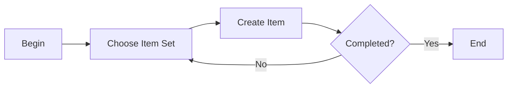

## Create Item




```URL
http://maxserver1.fyre.ibm.com:9080/maximo/oslc/os/mxitem?_lid=maxadmin&_lpwd=maxadmin
```

```JSON
{
    "spi:status": "ACTIVE",
    "spi:itemsetid": "DEVICES",
    "spi:itemnum": "IPhone15",
    "spi:rotating": "Y"
}
```
